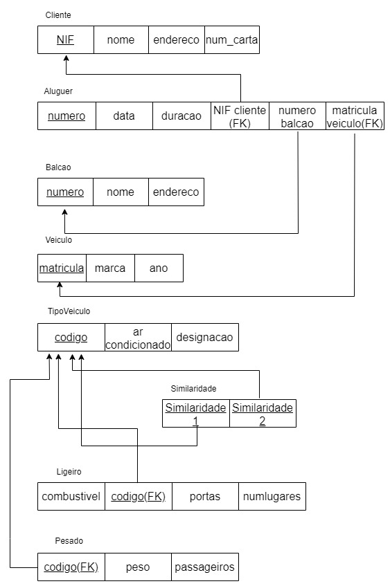
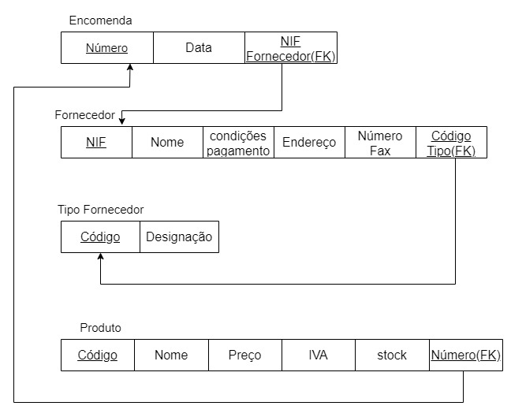
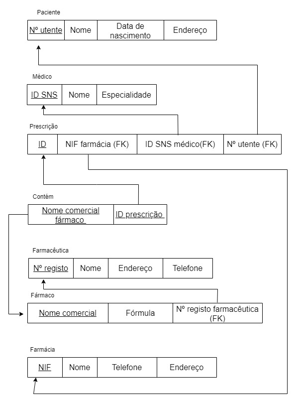
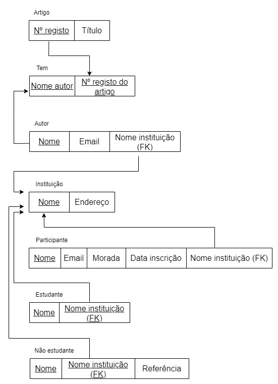

# BD: Guião 3


## ​Problema 3.1
 
### *a)*

```
-> Cliente: NIF, nome, endereço, num_carta;
-> Aluguer: numero, data, duracao;
-> Balcão: numero, nome, endereco;
-> Veículo: matricula, marca, ano;
-> Tipo_Veículo: codigo, ar condicionado, designacao;
-> Ligeiro: numLugares, portas, combustivel;
-> Pesado: peso, passageiros. 
-> Similaridade do veiculo
```


### *b)* 

```
Chaves candidatas:
	-> Cliente: NIF, num_carta;
	-> Aluguer: número;
	-> Balcão: número
	-> Veículo: Matrícula
	-> Tipo de veículo: código

Chaves primárias:
	-> Cliente: NIF;
	-> Aluguer: número;
	-> Balcão: número
	-> Veículo: matrícula
	-> Tipo de veículo: código

Chaves estrangeiras:
	-> Aluguer: NIF cliente, número do balcão e matrícula do veículo;
	-> Veículo: código do tipo
	-> Ligeiro: código do tipo
	-> Pesado: código do tipo 	
	-> Similaridade do tipo de veículo: código do tipo;
	
```


### *c)* 




## ​Problema 3.2

### *a)*

```
-> AIRPORT: Airport code, City, State, Name
-> AIRPLANE_TYPE: Type_name, Company, Max_seats
-> AIRPLANE: Airplane_ID, Total_no_of_seats, AIRPLANE_TYPE.Type_name
-> SEAT: Seat_no, Customer_name, Cphone, LEG_INSTANCE.Date
-> LEG_INSTANCE: Date, No_of_avail_seats, AIRPLANE.Airplane_ID, Dep_time, Arr_time, Departe AIRPORT.Code, Arrival AIRPORT.Code, FLIGHT.Number, FLIGHT_LEG.no
-> FARE: Restrictions, Amount, Code, FLIGHT.Number
-> FLIGHT: Number, Airline, Weekdays
-> FLIGHT_LEG: Leg_no, Departe AIRPORT.Code, Arrival AIRPORT.Code, Schedule_dep_time, Schedule_arr_time, FLIGHT.Number
-> CAN_LAND: AIRPORT.Airport_code, AIRPLANE.Type_name


```


### *b)* 

```
Chaves candidatas:
    -> AIRPORT: Airport_code
    -> AIRPLANE_TYPE: Type_name
    -> AIRPLANE: Airplane_ID
    -> SEAT: Seat_no
    -> LEG_INSTANCE: Date
    -> FARE: Code, Amount
    -> FLIGHT: Number, Airline
    -> FLIGHT_LEG: Leg_no
    -> CAN_LAND: AIRPORT.Airport_code, AIRPLANE.Type_name
Chaves Primárias:
    -> AIRPORT: Airport_code
    -> AIRPLANE_TYPE: Type_name
    -> AIRPLANE: Airplane_ID
    -> SEAT: Seat_no
    -> LEG_INSTANCE: Date
    -> FARE: Code
    -> FLIGHT: Number
    -> FLIGHT_LEG: Leg_no
Chaves Estrangeiras:
    -> AIRPLANE: Airplane_TYPE.Type_name
    -> SEAT: LEG_INSTANCE.Date
    -> LEG_INSTANCE: AIRPLANE.Airplane_ID, FLIGHT.Number, FLIGHT_LEG_no
    -> FARE: FLIGHT.Number
    -> FLIGHT_LEG: AIRPORT.Airport_Code, FLIGHT.Number
    -> CAN_LAND: AIRPORT.Airport_code, AIRPLANE.Type_name

```


### *c)* 


## ​Problema 3.3


### *a)* 2.1



### *b)* 2.2



### *c)* 2.3



### *d)* 2.4

